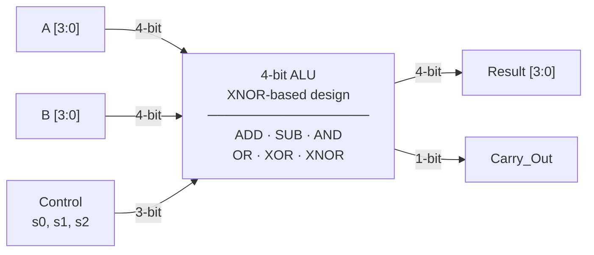

# Low Power Area Efficient ALU with Low Power Full Adder

> A 4-bit ALU designed using an XNOR-based full adder to reduce power consumption by ~50% compared to a conventional design, while supporting 6 arithmetic and logic operations through a 3-bit control signal.

---

## Table of Contents

- [Overview](#overview)
- [Features](#features)
- [Architecture](#architecture)
- [ALU Operations](#alu-operations)
- [Full Adder Design](#full-adder-design)
- [Control Signal Truth Table](#control-signal-truth-table)
- [Two's Complement Subtraction](#twos-complement-subtraction)
- [Verification & Testing](#verification--testing)
- [Results](#results)
---

## Overview

This project designs a **4-bit low-power ALU** built for use cases where minimizing energy consumption and circuit area matters — such as embedded processors and IoT hardware.

The core improvement is replacing the standard full adder (built from AND, OR, XOR gates) with an **XNOR-based full adder**. XNOR gates produce fewer signal transitions for typical input patterns, which directly lowers dynamic power consumption. The ALU supports 6 operations — ADD, SUB, AND, OR, XOR, XNOR — all selected through a compact 3-bit control input.

---

## Features

- 4-bit datapath supporting 6 operations
- XNOR-based full adder with ~50% lower power than the conventional design
- 3-bit control signal (s0, s1, s2) for operation selection
- Two's complement subtraction reusing the existing adder — no extra hardware
- Exhaustive simulation over all 256 input combinations (16 × 16) using ModelSim Student Edition

---

## Architecture

```
```
         ┌────────────────────────────────────┐
  A[3:0] │                                    │
─────────►                                    ├──► Result[3:0]
         │         4-bit ALU                  │
  B[3:0] │                                    ├──► Carry_Out
─────────►                                    │
         │                                    │
s2,s1,s0 │                                    │
─────────►                                    │
         └────────────────────────────────────┘
```



The ALU contains:
- **4 XNOR-based full adder cells** connected as a ripple-carry adder
- **Parallel logic units** for AND, OR, XOR, XNOR operating on A and B simultaneously
- **A multiplexer** driven by s0, s1, s2 that selects which result appears at the output
- **Conditional B-inversion** via XOR gates and a forced carry-in of 1 for subtraction

---

## ALU Operations

| Operation | Description               | Control (s2 s1 s0) |
|-----------|---------------------------|--------------------|
| ADD       | A + B                     | 0 0 0              |
| SUB       | A − B (two's complement)  | 0 0 1              |
| AND       | A AND B (bitwise)         | 0 1 0              |
| OR        | A OR B (bitwise)          | 0 1 1              |
| XOR       | A XOR B (bitwise)         | 1 0 0              |
| XNOR      | A XNOR B (bitwise)        | 1 0 1              |

---

## Full Adder Design

### Conventional Design

A standard 1-bit full adder computes:

```
Sum   = A XOR B XOR Cin
Carry = (A AND B) OR (B AND Cin) OR (A AND Cin)
```

This requires multiple AND, OR, and XOR gates. Each gate transition (0→1 or 1→0) consumes power, and this design has a high number of such transitions per computation.

### XNOR-Based Design (This Project)

The full adder is restructured to use XNOR gates as the primary building block:

```
Sum   = (A XNOR B) XNOR Cin
Carry = derived by reusing the same XNOR intermediate output
```

XNOR gates switch less frequently than XOR gates for common input patterns, so fewer transitions occur per operation. The intermediate XNOR result (A XNOR B) is shared between the Sum and Carry computations — this eliminates duplicate gate paths and reduces both power and gate count. The result is approximately **50% lower power consumption** than the conventional design at the same speed.

---

## Control Signal Truth Table

| s2 | s1 | s0 | Operation Selected |
|----|----|----|-------------------|
| 0  | 0  | 0  | ADD               |
| 0  | 0  | 1  | SUB               |
| 0  | 1  | 0  | AND               |
| 0  | 1  | 1  | OR                |
| 1  | 0  | 0  | XOR               |
| 1  | 0  | 1  | XNOR              |

All six functional units run in parallel. The control signals only determine which result the output multiplexer passes through — this keeps the critical path delay the same regardless of which operation is selected.

---

## Two's Complement Subtraction

Subtraction is performed without a separate subtractor circuit:

```
A − B  =  A + (NOT B) + 1
```

When SUB is selected (s0 = 1), each bit of B passes through an XOR gate with s0, which inverts it. The carry-in of the first full adder is set to 1. The same ripple-carry adder that handles addition then computes A + (NOT B) + 1, which equals A − B by two's complement. This reuse of hardware keeps area low.

---

## Verification & Testing

The ALU was designed in Verilog and verified through digital simulation using **ModelSim Student Edition**.

**What was tested:**
- All 4-bit input combinations for A and B — 16 × 16 = 256 input pairs
- All 6 operations applied to each pair — totalling 1,536 simulated cases
- Correct Sum and Carry output for ADD across all input values
- Correct result for SUB including cases where the result requires borrow
- Correct bitwise output for AND, OR, XOR, XNOR
- Corner cases: addition overflow (e.g. 1111 + 0001), zero result (A − A), all-zeros, all-ones inputs

**What was measured after simulation:**
- Power consumption — compared between the XNOR-based design and the conventional full adder under the same input switching conditions
- Gate count / circuit area — confirmed that XNOR reuse reduces the number of gates needed
- Critical path delay — checked that the new design meets the same timing as the conventional one

All 1,536 test cases produced correct outputs, and the power measurement confirmed the ~50% reduction from the redesigned full adder.

---

## Results

| Metric              | Conventional Design | XNOR-Based Design (This Project) |
|---------------------|--------------------|---------------------------------|
| Power Consumption   | Baseline           | ~50% lower                      |
| Full Adder Gates    | More (no sharing)  | Fewer (XNOR output reused)       |

The main gain comes from the XNOR-based full adder: fewer gate transitions per operation and shared intermediate signals reduce both power and gate count, without changing the number of supported operations or slowing down the circuit.


